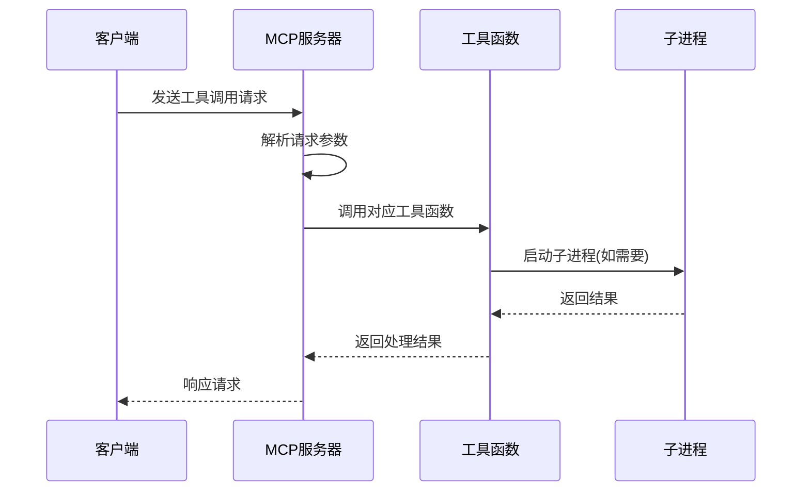
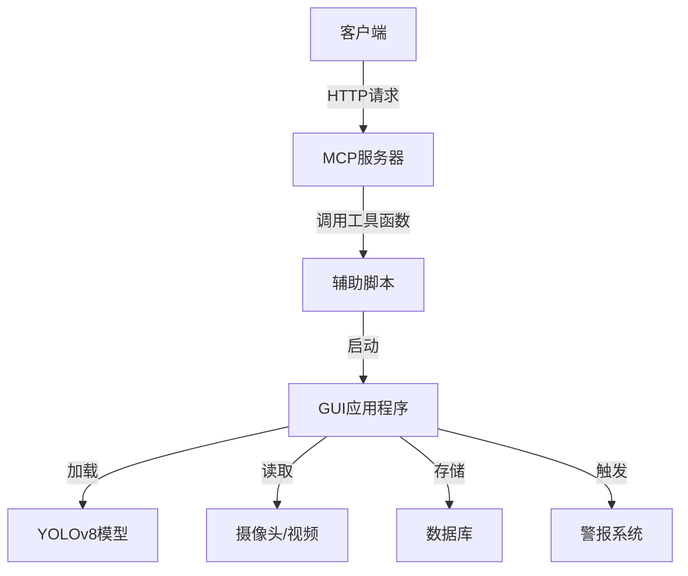
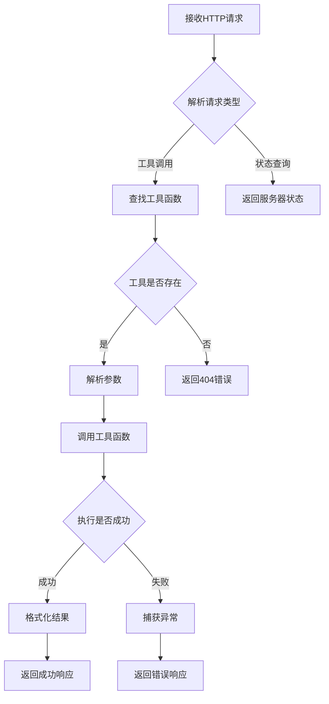

# 人车检测MCP系统

基于YOLOv8的实时人车检测与警报系统

<div class="pt-12">
  <span @click="$slidev.nav.next" class="px-2 py-1 rounded cursor-pointer" hover="bg-white bg-opacity-10">
    开始演示 <carbon:arrow-right class="inline"/>
  </span>
</div>

<div class="abs-br m-6 flex gap-2">
  <button @click="$slidev.nav.openInEditor()" title="在编辑器中打开">
    <carbon:edit />
  </button>
</div>

---
layout: image-right
image: https://source.unsplash.com/collection/94734566/1920x1080
---

# 系统概述

人车检测MCP系统是一个基于YOLOv8的实时检测系统，具有以下特点：

- 📊 **实时检测** - 对视频流中的人和车辆进行实时检测
- 🔔 **警报功能** - 当检测到的人数超过阈值时触发警报
- 💾 **数据存储** - 将检测结果保存到数据库中
- 🔍 **历史查询** - 支持查询历史检测记录
- 🧩 **MCP接口** - 通过MCP协议提供API接口

---

# 什么是MCP？

<div grid="~ cols-2 gap-4">
<div>

## Multi-Call Protocol

MCP (Multi-Call Protocol) 是一种允许AI通过API调用工具函数的协议。

### 主要特点：

- 标准化的工具调用接口
- 支持多种编程语言
- 简化AI与工具的集成
- 易于扩展和维护

</div>
<div>

```python
from fastmcp import FastMCP

# 创建MCP实例
mcp = FastMCP("person_car_detector")

# 注册工具函数
@mcp.tool()
def start_detection(source_type="camera"):
    """启动人车检测系统"""
    # 实现代码...
    return {"status": "success"}

# 启动MCP服务器
if __name__ == "__main__":
    mcp.run()
```

</div>
</div>

---

# MCP的核心概念

<div grid="~ cols-2 gap-4">
<div>

## 工具函数注册

MCP通过装饰器模式将普通函数转换为可远程调用的API端点：

- **@mcp.tool()** - 注册函数为工具
- **参数验证** - 自动检查和转换参数类型
- **文档生成** - 从函数文档字符串生成API文档
- **权限控制** - 可设置访问权限和调用限制

</div>
<div>

## 通信协议

MCP支持多种通信方式：

- **HTTP API** - RESTful接口，默认端口5000
- **WebSocket** - 支持双向实时通信
- **stdio模式** - 通过标准输入输出流通信
- **自定义协议** - 可扩展支持其他协议

</div>
</div>

---

# MCP服务器工作原理

<div class="mt-4"></div>



---

# MCP服务器架构详解

<div grid="~ cols-2 gap-4">
<div>

## 服务器组件

- **路由系统** - 将请求映射到工具函数
- **参数解析器** - 转换和验证请求参数
- **执行引擎** - 调用工具函数并处理结果
- **响应格式化** - 将结果转换为标准格式
- **错误处理** - 捕获和处理异常情况

</div>
<div>

## 启动流程

1. 初始化MCP实例
2. 扫描和注册工具函数
3. 配置服务器参数
4. 启动HTTP服务器
5. 监听请求
6. 处理请求并调用工具
7. 返回结果

</div>
</div>

---

# MCP与传统API的区别

<div class="mt-2"></div>

| 特性 | MCP | 传统REST API | gRPC |
|------|-----|-------------|------|
| 接口定义 | 函数装饰器 | OpenAPI/Swagger | Protobuf |
| 参数验证 | 自动类型检查 | 需手动实现 | 编译时检查 |
| 文档生成 | 自动从函数注释生成 | 需手动维护 | 从.proto文件生成 |
| 客户端生成 | 自动生成 | 需手动实现 | 自动生成 |
| AI集成友好度 | 极高 | 一般 | 一般 |
| 部署复杂度 | 低 | 中 | 高 |

---
layout: two-cols
---

# 系统架构

<div class="mt-4 mermaid-diagram"></div>



::right::

# 技术栈

<div class="mt-10"></div>

- **前端**：PyQt5 GUI界面
- **后端**：Python, FastMCP
- **AI模型**：YOLOv8目标检测
- **数据库**：MySQL
- **多媒体**：OpenCV, Pygame
- **部署**：Cursor MCP集成

---

# MCP在Cursor中的集成

<div grid="~ cols-2 gap-4">
<div>

## Cursor MCP框架

Cursor将MCP作为核心技术，实现AI与工具的无缝集成：

- **工具发现** - 自动识别和注册MCP服务器
- **接口生成** - 为AI生成工具调用接口
- **上下文共享** - 在AI和工具间共享上下文
- **状态管理** - 维护会话和工具调用状态

</div>
<div>

## mcp.json配置

```json
{
  "mcpServers": {
    "person_car_detector": {
      "command": "/opt/anaconda3/bin/python3",
      "args": [
        "/Users/p/Desktop/testProject_2/p1/person_car_detector_gui.py",
        "--stdio"
      ],
      "env": {
        "PYTHONPATH": "/Users/p/Desktop/testProject_2",
        "PYTHONUNBUFFERED": "1"
      }
    }
  }
}
```

</div>
</div>

---

# MCP工具函数

人车检测系统提供了三个主要的MCP工具函数：

```python
@mcp.tool()
def start_detection(source_type="camera", source_path=None, 
                   conf_threshold=0.5, person_threshold=3):
    """启动人车检测系统"""
    # 实现代码...

@mcp.tool()
def list_detection_sessions(start_date=None, end_date=None, limit=10):
    """列出检测会话记录"""
    # 实现代码...

@mcp.tool()
def get_detection_records(session_id, limit=20):
    """获取指定会话的检测记录"""
    # 实现代码...
```

---

# MCP请求处理流程

<div class="mt-4"></div>



---
layout: image-right
image: https://source.unsplash.com/collection/94734566/1920x1080
---

# 在Cursor中部署

1. 配置`mcp.json`文件
2. 重启Cursor应用
3. 打开MCP仪表板
4. 启动人车检测MCP服务器
5. 通过Cursor接口调用功能

```json
"person_car_detector": {
    "command": "/opt/anaconda3/bin/python3",
    "args": [
        "/Users/p/Desktop/testProject_2/p1/person_car_detector_gui.py",
        "--stdio"
    ],
    "env": {
        "PYTHONPATH": "/Users/p/Desktop/testProject_2",
        "PYTHONUNBUFFERED": "1"
    },
    "description": "人车检测系统MCP服务器"
}
```

---

# MCP服务器调试技巧

<div grid="~ cols-2 gap-4">
<div>

## 常见问题排查

- **端口冲突** - 检查5000端口是否被占用
- **依赖问题** - 确保所有Python依赖已安装
- **路径问题** - 验证文件路径是否正确
- **权限问题** - 检查执行权限和文件访问权限
- **环境变量** - 确认环境变量设置正确

</div>
<div>

## 调试命令

```bash
# 检查端口占用
lsof -i :5000

# 直接运行MCP服务器
python p1/person_car_detector_gui.py --stdio

# 测试API调用
curl -X POST http://localhost:5000/tools/start_detection \
  -H "Content-Type: application/json" \
  -d '{"source_type": "camera"}'

# 查看日志
tail -f logs/gui_log_*.txt
```

</div>
</div>

---
layout: center
class: text-center
---

# 演示流程

<div grid="~ cols-3 gap-4">
<div>

### 1. 启动MCP服务器

```bash
python p1/person_car_detector_gui.py --stdio
```

</div>
<div>

### 2. 发送API请求

```bash
curl -X POST http://localhost:5000/tools/start_detection -H "Content-Type: application/json" -d '{"source_type": "camera"}'
```

</div>
<div>

### 3. 查看检测结果

GUI界面会显示实时检测结果，并在检测到过多人员时触发警报。

</div>
</div>

---

# 系统功能演示

<div grid="~ cols-2 gap-4">
<div>

## 实时检测

- 支持摄像头和视频文件输入
- 可调整检测阈值和处理频率
- 显示FPS和检测统计信息

## 警报功能

- 可设置人数阈值触发警报
- 声音和视觉双重提醒
- 支持警报冷却时间设置

</div>
<div>

## 历史记录查询

- 按时间范围查询历史会话
- 查看详细的检测记录
- 预览保存的图像

## 系统设置

- 调整检测参数
- 配置图像保存选项
- GPU加速支持

</div>
</div>

---

# MCP未来发展方向

<div grid="~ cols-2 gap-4">
<div>

## 技术演进

- **多模态支持** - 处理更多类型的输入和输出
- **联邦学习** - 分布式模型训练和推理
- **安全增强** - 加密通信和访问控制
- **自动扩展** - 根据负载动态调整资源
- **跨语言支持** - 更多编程语言的原生支持

</div>
<div>

## 应用场景扩展

- **智慧城市** - 城市安全监控和交通管理
- **工业自动化** - 生产线质量控制和安全监测
- **医疗健康** - 患者监护和异常行为检测
- **零售分析** - 客流量统计和行为分析
- **智能家居** - 家庭安全和异常事件检测

</div>
</div>

---
layout: center
class: text-center
---

# 谢谢观看！

[项目源码](https://github.com/yourusername/person-car-detector) · [文档](https://your-docs-site.com) 